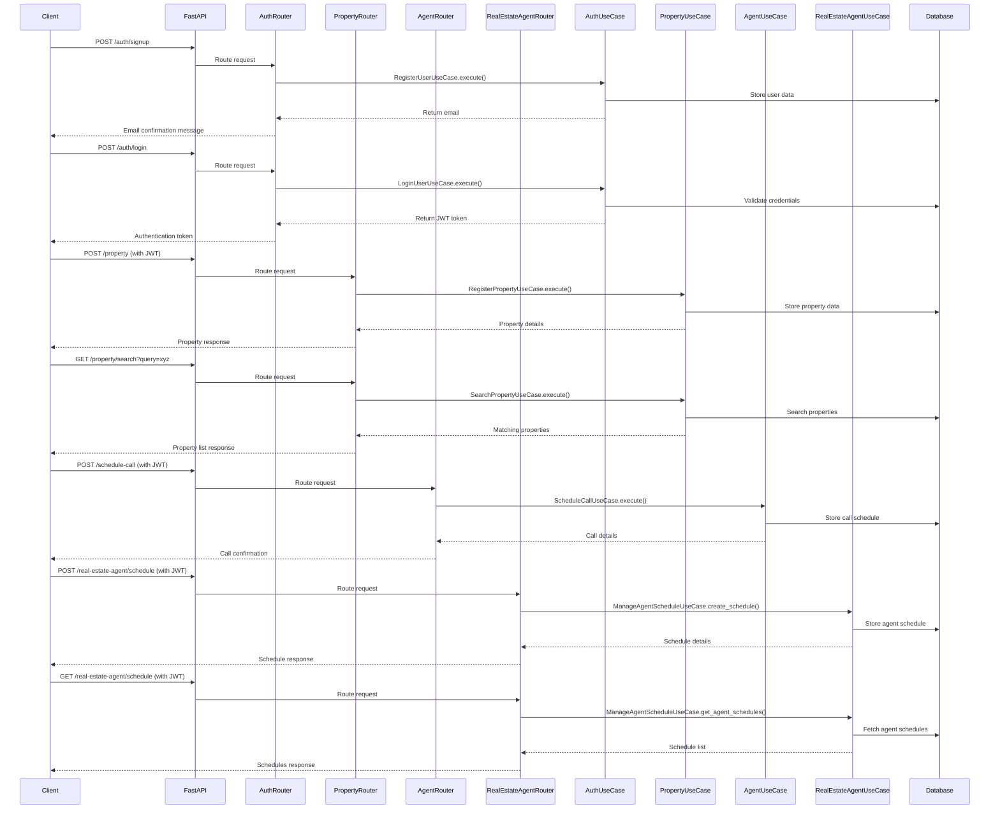

# Real Estate Agent Helper API

A FastAPI application that helps real estate agents manage properties, schedules, and clients.

## Prerequisites

- Docker
- Docker Compose

## Getting Started

### Running with Docker

1. Clone the repository:

```bash
git clone <repository-url>
cd real-state-agent-fastapi
```

2. Build and start the application using Docker Compose:

```bash
docker-compose up -d
```

This will start:

- The FastAPI application on <http://localhost:8000>
- A PostgreSQL database

3. API Documentation:

- Swagger UI: <http://localhost:8000/docs>
- ReDoc: <http://localhost:8000/redoc>

### Development

If you want to run the application without Docker:

1. Create a virtual environment and install dependencies:

```bash
python -m venv .venv
source .venv/bin/activate  # On Windows: .venv\Scripts\activate
pip install uv
uv pip install -e .
```

2. Set up the PostgreSQL database and update the DATABASE_URL in your environment variables.

3. Run migrations:

```bash
alembic upgrade head
```

4. Start the application:

```bash
uvicorn main:app --reload
```

## API Endpoints

The API includes several endpoints:

- **Authentication**: User registration and login
- **Properties**: Register and search properties
- **Agents**: Schedule calls with agents
- **Real Estate Agent Management**: Manage agent schedules

For detailed API documentation, check the Swagger UI after starting the application.

## Sequence Diagram


## Roadmap

The following features are planned for upcoming releases:

### 1. Agent-Assisted Deal Matching

Our AI-powered deal matching system will:

- Continuously monitor agent portfolios to identify optimal collaboration opportunities
- Provide commission-split negotiation assistance based on game theory principles
- Maximize revenue through strategic portfolio sharing

### 2. Portfolio Risk Management

Intelligent risk management will help agents:

- Analyze portfolio risk and identify diversification opportunities through strategic sharing
- Implement dynamic hedging strategies through collaborative agreements

### 3. Process Automation for Collaborative Deals

Workflow automation for multi-agent transactions will:

- Handle the complexity of document sharing, signatures, and approvals
- Coordinate schedules and responsibilities automatically
- Ensure transparent commission distribution
- Reduce administrative overhead and eliminate errors in collaborative deals

### 4. Microservices Architecture

To improve performance and deployment flexibility, we'll break the application into microservices:

- Split into separate services for auth, property management, agent interactions, and analytics
- Implement containerized deployments with smaller, optimized Docker images
- Enable independent scaling of high-demand components
- Improve development velocity through parallel feature implementation
